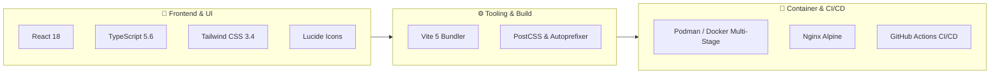

<div align="center">

# ⚡ Ikhsan Ibnu Abdullah — Engineering Portfolio

**Full-Stack Software Engineer • Systems Architecture • Distributed Applications**

[](https://reactjs.org/)
[](https://www.typescriptlang.org/)
[](https://vitejs.dev/)
[](https://tailwindcss.com/)
[](https://podman.io/)
[](https://github.com/features/actions)

<br />

[**🌐 Explore Live Site**](https://sall-lah.github.io/portofolio/) • [**📬 Get in Touch**](#-get-in-touch) • [**🚀 Showcase Projects**](#-featured-projects)

</div>

---

## 📖 Overview

A modern, high-performance developer portfolio engineered with a focus on editorial typography, grounded aesthetics, and accessible web standards. Built from the ground up with **React 18**, **TypeScript**, and **Tailwind CSS**, containerized via **Podman / Docker multi-stage builds**, and automated with **GitHub Actions CI/CD**.

---

## ✨ Key Highlights

- 🖥️ **Full Monitor Height Section Pacing (`min-h-screen`)**: Every major landmark section cleanly spans full viewport height on desktop monitors while dynamically adapting with fluid padding on mobile screens.
- 🌊 **Staggered Character Wave Typography**: Hero section headlines feature per-character CSS keyframe wave animations without mid-word breaking.
- 📐 **Harmonized Project Cards**: Equalized, balanced showcase cards displaying static high-resolution preview frames, tech stack pills, and direct access action triggers.
- 🛡️ **Interactive Contact Form & Security**: Zero-backend serverless email delivery powered by Web3Forms API, featuring client-side regex validation, state management, and hidden honeypot spam protection.
- ⚡ **Sub-Second Performance**: Pure static tree bundling via Vite 5, code-splitting, lazy-loaded media assets, and zero runtime bloat.
- 🐳 **Containerized & Production-Ready**: Multi-stage Dockerfile bundling Node.js 20 Alpine builder with a secure, hardened Nginx Alpine runner.

---

## 🛠️ Technology Ecosystem



---

## 🚀 Featured Projects

<table>
  <tr>
    <td width="50%">
      <h3 align="center">🏃 Fitlife</h3>
      <p align="center">
        <b>Full-stack health & wellness platform with biometric analytics and AI-powered meal recommendations.</b>
      </p>
      <p>
        A comprehensive wellness tracking ecosystem featuring real-time BMI/TDEE calculation with predictive weight trend modeling, calendar-based nutrition and workout scheduling, custom activity routines, and AI-driven daily dietary recommendations.
      </p>
      <p>
        <code>React</code> • <code>Vite</code> • <code>Tailwind CSS</code> • <code>Express</code> • <code>Docker</code> • <code>Supabase</code>
      </p>
      <p align="center">
        <a href="https://fit-life-9173571fa1fb.herokuapp.com/"><b>[ Live Demo ]</b></a> &nbsp;•&nbsp;
        <a href="https://github.com/nv-hr/Fitness_App"><b>[ Source Code ]</b></a>
      </p>
    </td>
    <td width="50%">
      <h3 align="center">🎮 SpecialGift</h3>
      <p align="center">
        <b>Real-time multiplayer survival shopping party game powered by an automated AI Executioner.</b>
      </p>
      <p>
        A real-time multiplayer browser party game where players navigate bizarre survival scenarios through timed marketplace budget challenges. An AI Executioner Judge evaluates item synergy, generates dark-comedy survival narratives, and calculates real-time HP impact.
      </p>
      <p>
        <code>React</code> • <code>Vite</code> • <code>Tailwind CSS</code> • <code>Docker</code> • <code>Express</code>
      </p>
      <p align="center">
        <a href="https://special-gift-ea7251652f65.herokuapp.com/"><b>[ Live Demo ]</b></a> &nbsp;•&nbsp;
        <a href="https://github.com/Sall-lah/SpecialGift"><b>[ Source Code ]</b></a>
      </p>
    </td>
  </tr>
  <tr>
    <td colspan="2">
      <h3 align="center">🛍️ Clothes Store</h3>
      <p align="center">
        <b>High-performance e-commerce gateway and distributed event-driven microservices architecture.</b>
      </p>
      <p>
        A scalable retail e-commerce platform backend built in Go. Architected with high-throughput API gateway routing, Redis caching for sub-millisecond query responses, Apache Kafka asynchronous event streaming, Nginx reverse proxying, and Cloudflare R2 object storage.
      </p>
      <p align="center">
        <code>Go</code> • <code>Redis</code> • <code>Kafka</code> • <code>Nginx</code> • <code>Cloudflare R2</code>
      </p>
      <p align="center">
        <a href="https://github.com/Sall-lah/store_gateway"><b>[ View Backend Repository ]</b></a>
      </p>
    </td>
  </tr>
</table>

---

## 📂 Project Structure

```text
portofolio/
├── .github/
│   └── workflows/
│       └── deploy.yml          # GitHub Actions automated deployment
├── public/
│   ├── icon/                   # Tech stack vector brand logos
│   ├── project/                # High-res project showcase screenshots
│   │   ├── FitLife.png
│   │   ├── SpecialGift-Display.png
│   │   └── Store.png
│   ├── owner_image.jpeg        # Profile avatar
│   └── favicon.svg             # Website favicon
├── src/
│   ├── components/
│   │   ├── layout/             # Sticky Navbar, Footer, Navigation
│   │   ├── sections/           # Hero, Projects, Skills, Contact
│   │   └── ui/                 # Reusable buttons, badges, skill logos, modal
│   ├── data/                   # Structured data (projects, skills, siteConfig)
│   ├── types/                  # Strict TypeScript contracts & interfaces
│   ├── App.tsx                 # Root layout assembler
│   ├── main.tsx                # Entry point
│   └── index.css               # Design system tokens & Tailwind rules
├── Dockerfile                  # Multi-stage production container build
├── nginx.conf                  # Production HTTP & caching configuration
├── tailwind.config.js          # Custom theme extensions & typography
├── tsconfig.json               # TypeScript strict configuration
└── vite.config.ts              # Vite bundler & asset resolution settings
```

---

## 💻 Getting Started Locally

### Prerequisites

- **Node.js**: `v18.0.0+` (Node 20 recommended)
- **Package Manager**: `npm`, `pnpm`, or `yarn`

### 1. Clone & Install

```bash
# Clone the repository
git clone https://github.com/Sall-lah/portofolio.git
cd portofolio

# Install dependencies
npm install
```

### 2. Environment Variables (Optional)

Create a `.env` file in the root directory:

```env
VITE_WEB3FORMS_ACCESS_KEY="your-web3forms-access-key"
```

### 3. Start Development Server

```bash
npm run dev
```

Visit [`http://localhost:3000`](http://localhost:3000) in your browser.

### 4. Production Build & Preview

```bash
# Typecheck & bundle production build
npm run build

# Preview production build locally
npm run preview
```

---

## 🐳 Container Deployment (Podman / Docker)

### Build Image

```bash
podman build -t developer-portfolio:latest .
# or with docker:
# docker build -t developer-portfolio:latest .
```

### Run Container

```bash
podman run -d --name developer-portfolio -p 8080:80 localhost/developer-portfolio:latest
```

The containerized portfolio is now live on [`http://localhost:8080`](http://localhost:8080).

---

## 🌐 Deploy to GitHub Pages

This project is pre-configured with **GitHub Actions** for automated deployments:

1. Push your changes to the `main` branch:
   ```bash
   git add .
   git commit -m "feat: updates"
   git push origin main
   ```
2. In your GitHub repository, navigate to **Settings** > **Pages**.
3. Under **Build and deployment** > **Source**, select **GitHub Actions**.
4. *(Optional)* Add `VITE_WEB3FORMS_ACCESS_KEY` to **Settings** > **Secrets and variables** > **Actions** for live contact form submissions.

---

## 📬 Get in Touch

<div align="center">

**Ikhsan Ibnu Abdullah** — *Full-Stack Software Engineer*

[](https://github.com/Sall-lah)
[](https://linkedin.com/in/ikhsan-ibnu-abdullah)
[](mailto:ikhsanibnuabdullah@gmail.com)

</div>

---

<div align="center">
  <sub>Designed & Developed with ❤️ by <a href="https://github.com/Sall-lah">Ikhsan Ibnu Abdullah</a></sub>
</div>
